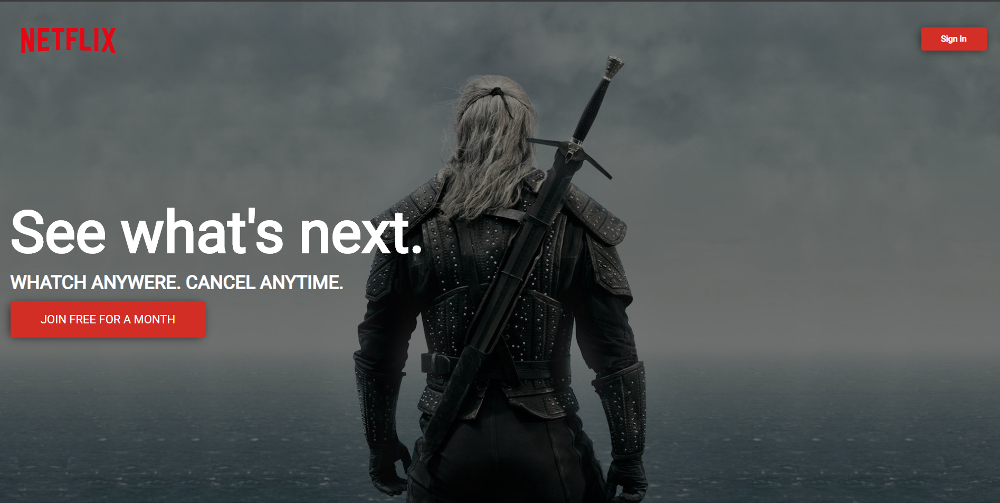

<h1 align="center">   Netflix Clone    </h1>

<h2>  Objetivo do projeto  </h2>
 
 Aperfeiçoamento das tecnologias e estudo
    sobre determinadas propriedades do CSS.
  

<h2> Fase de Desenvolvimento </h2>

 Foi usado HTML simples com elementos possuindo suas respectivas classes para ajudar na
estilização dos mesmos. O CSS foi construído em sua maior parte com o uso de FlexBox, propriedade nativa que nos fornece muitas vantagens em relação ao posicionamento dos elementos.
 

 
 O projeto teve como referência a página inicial da Netflix, respeitando suas cores e identidade visual. 

 <h2> Resultado final & Conclusão </h2>

 Após o término do projeto tentei limpar o
    código e torná-lo mais simples e limpo, característica que irei aperfeiçoar cada vez mais em meus projetos.

